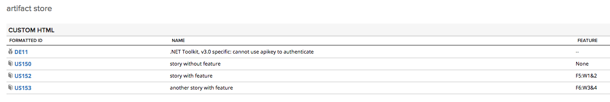

Artifact Store example
=========================

## Overview
Example of using [Rally.data.wsapi.artifact.Store](https://help.rallydev.com/apps/2.0/doc/#!/api/Rally.data.wsapi.artifact.Store)
It shows Feature field can be accessed on user stories in artifact store, while other types in the store don't have that field. 

This app comes AS IS. It is not supported by Rally support.
## License

AppTemplate is released under the MIT license.  See the file [LICENSE](./LICENSE) for the full text.

##Documentation for SDK

You can find the documentation on our help [site.](https://help.rallydev.com/apps/2.0/doc/)
